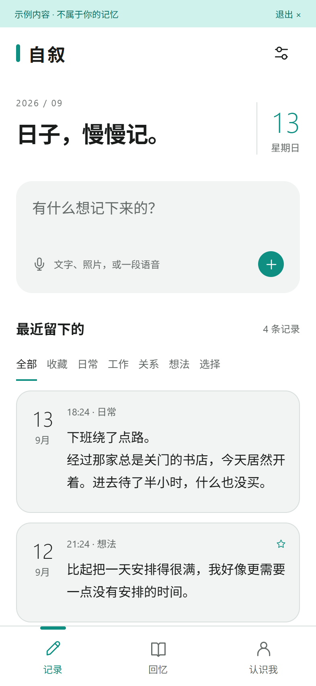
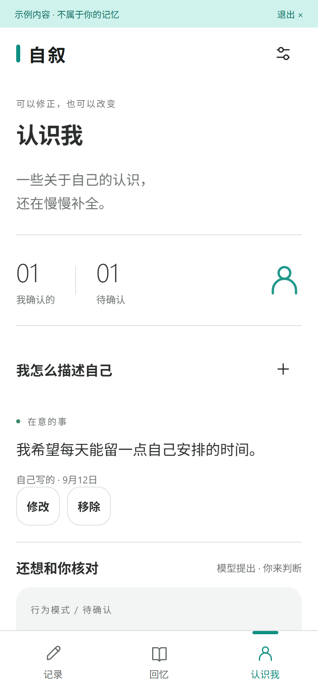
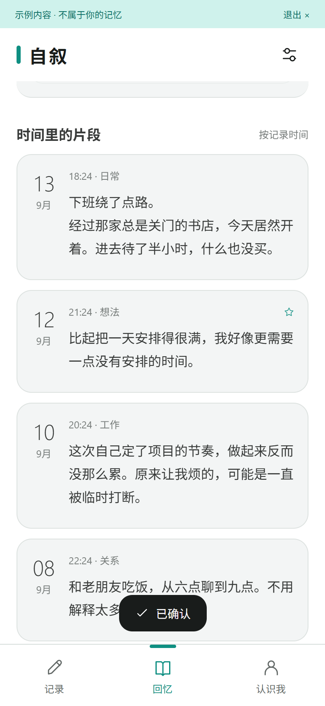

# 自叙 · 安卓预览版

一个本地优先的第二记忆应用。记下经历，找回原文，逐渐形成可以修正的自我认识。

当前版本：0.5.0。安装包在 [Releases](../../releases) 页面提供（开发签名的预览包，仅供本地安装验证）。

<p>
  
  
  
</p>

图片来自同一套界面的网页手机尺寸预览，内容均为虚构示例，不是真机截图。

## 当前功能

- 文字记录与自动保存文字草稿，分类、收藏、中文原文搜索；支持拍照与照片附件。
- 主动录音支持暂停、继续与完成；完成后留在编辑页，继续补充文字、照片，再保存整条记录。当前不自动转写。
- 记录修改保留原文历史。删除、修改经历会标记依赖旧内容的个人观察，请用户重新核对。
- 左右滑动在 记录 / 回忆 / 认识我 之间切换（原生分页，带方向性过渡）。
- 自己撰写个人档案；模型从多条记录提出带来源的候选观察，由用户确认、改写或搁置；可预览并导出 SKILL.md，携带已确认的自我认识到其他 AI 使用（不包含原始记忆、附件或密钥）。
- 根据相关文字记录提问，并查看本次提供给模型的来源。
- 用户自备 API Key，支持 HTTPS Chat Completions 兼容服务。提供 DeepSeek、千问、Kimi、智谱、硅基流动、OpenRouter、Gemini 和自定义接口。
- Android SecureStore 分别保存各供应商的地址、模型与 Key；切换和返回时保存，Key 不进入记忆备份。网页预览的 Key 仅留在当前页面内存。
- 支持浅色、深色和跟随系统；设置持久化。连接测试结果直接显示在设置页；计费和发送范围说明集中放在设置页。
- 完整 JSON 备份与恢复，包含原文、附件、修订和档案。附件采用 SHA-256 校验。
- 隔离的虚构示例模式，不写入用户的真实记忆。

## 运行

源码在 `mobile/`。Node 22.13+；当前使用 Node 24、Expo SDK 57 / React Native 0.86。

```powershell
cd mobile
npm ci
npm run prepare:native
npx expo start
```

Android 原生开发需要 JDK 17 和 Android SDK 36：

```powershell
npx expo run:android
```

生成独立 APK（不依赖开发服务器）：

```powershell
npx expo prebuild --platform android
cd android
.\gradlew.bat assembleRelease -PreactNativeArchitectures=arm64-v8a
```

Expo 生成项目的 release 默认使用开发签名，只用于预览安装，不能直接作为正式商店发布配置。公开发布前需配置你自己的签名并安全保存，后续升级必须沿用同一签名。

`prepare:native` 仅修改本项目安装的构建辅助库，给 Windows 的 `cmd /c` 增加 `/d`，防止系统 AutoRun 欢迎文字破坏 JSON 输出，不修改系统注册表。可通过 `-PzixuNdkVersion=28.2.13676358` 选择本机已安装的 NDK；不传则沿用 Expo 默认。

Windows 建议将项目放在英文路径，避免 Java/Gradle 子进程处理中文路径时的编码问题。

也可用 `mobile/eas.json` 的 preview 配置在自己的 Expo 账户中构建。这个项目没有绑定或上传到任何云构建账户。

## 验证

```powershell
cd mobile
npx tsc --noEmit
node --experimental-strip-types --test tests/core.test.ts
npx expo export --platform web
node scripts/serve.cjs
# 另一个终端；脚本使用本机 Chrome，可按实际安装位置修改
node scripts/smoke.cjs
```

其余冒烟脚本（交互、模拟 AI 工作流、附件、价值观档案）用法相同，AI 相关测试使用拦截的虚构域名，不消耗真实额度。网页是同一套 React Native 界面的辅助预览，不是另做的桌面产品。其数据使用浏览器本地存储，Key 仅存在当前页面内存。网页与 Android 备份格式有意隔离，避免把浏览器临时附件当成安卓持久文件。

## 数据约定

Android 在应用私有目录内使用 SQLite 存储一个原子更新的版本化记忆快照；附件单独保存。所有修改进入串行队列，保存成功后再更新界面。不依赖云端数据库。

这是小规模预览版，全文搜索为本地字符串匹配，问答候选使用简单词片段匹配及时间排序，并非向量检索。大型记忆库应迁移为逐记录 SQL 表与可重建索引。

## 隐私与安全

- 不提供使用遥测，不把私人记录上传到任何服务器；仅在使用整理、问答与连接测试时按用户配置调用其自选的模型服务商。
- 记录保存在应用私有目录；API Key 保存在 Android SecureStore，不进入备份。
- 备份 JSON 未加密，请自行存放在可信位置；不要将个人记录、Key、备份或签名文件提交到版本库。
- 发布的安装包为开发签名预览包，仅用于本地安装验证；正式分发前应更换为自行保管的正式签名。

## 当前边界

- 尚无云同步、桌面小组件、系统分享接收、语音转写、后台持续录音、照片内容识别。
- 录音切到后台会尝试结束并加入当前编辑页附件，不自动提交整条记录；进程被系统强杀、电话中断等行为仍需真机验证。不能承诺恢复所有未结束的录音。
- 附件总计最多 30 MB 的完整备份；导入文件上限 50 MB。恢复会替换本机库，操作前先备份。
- 本机数据库未使用 SQLCipher；备份 JSON 未加密。API Key 单独安全存储。
- 模型推测始终待确认；来源有效不代表语义一定正确。观察只分析最近最多 30 条文字，问答提供最多 20 条候选，每条最多前 3000 字，并参考最多 40 条个人反馈或已确认档案；没有训练人格模型。
- 真实服务商计费调用和不同安卓厂商的权限行为需用户真机验证。

架构、记忆稳定性设计与发布路线见 `docs/ARCHITECTURE.md`；构建与测试记录见 `docs/`。

## 许可证

[MIT](mobile/LICENSE)
